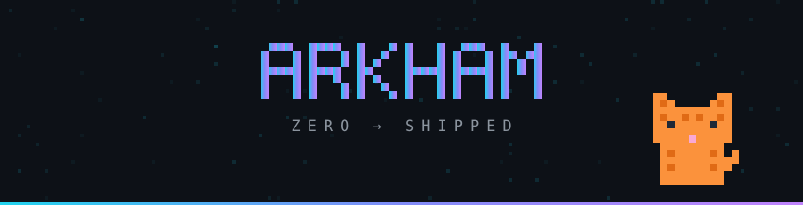
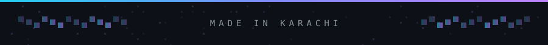

**i build things end to end.** most of it ai-assisted now: 
internal tools, scrapers, chatbots, dashboards, and occasionally a whole platform.

 

## 🛠 shipped

| | |
|:--|:--|
| **ai audio journal** | whisper → llm for reflective responses. **acquired.** |
| **ai quality assurance platform** | built for a textile manufacturer. client **resold it commercially.** |
| **custom cms** | replaced wordpress across **64 releases**, plus an arabic localisation layer |
| **search recovery** | someone deindexed half our site. found it, fixed it. **102 → 258 clicks/day** |

 

## 🧭 how i work

**ship the smallest thing that proves the point.** prototypes beat decks. if it can be real in a day, it shouldn't be a mockup for a week.

**the hard part is never the code.** it's getting business, design and engineering to agree on what we're actually building. most of my week goes there.

**measure it or it didn't happen.** i went looking for why signups were flat and found 69% of new accounts had never been used. nobody had checked.

 

## ⚡ stack

 

## 🌱 currently

- **product & growth @ wondertree** — therapeutic games for kids with special needs
- **co-founder & co-lead**, friends of figma karachi
- **co-founder** of a computer hardware business i still run

 

guitar, drums and keys, enough to record · more monitors than rooms · an electric motorcycle in a city that wasn't built for one · supervised by an orange cat

  

